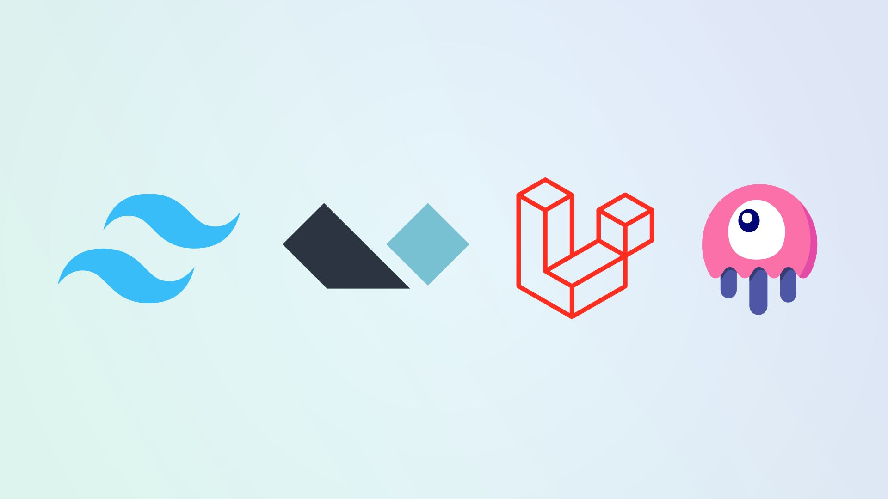
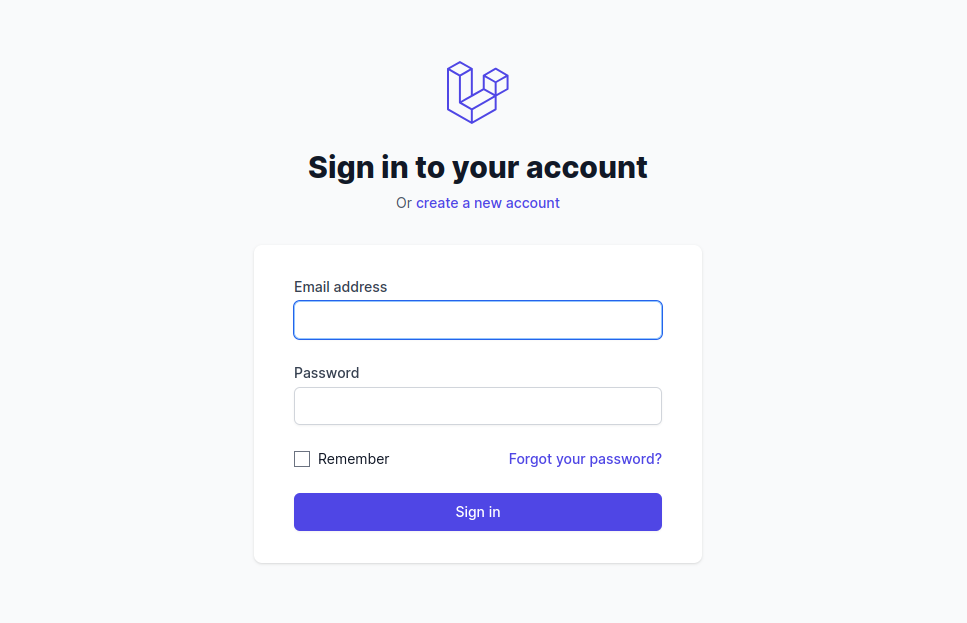
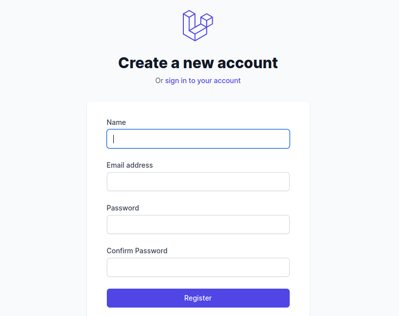
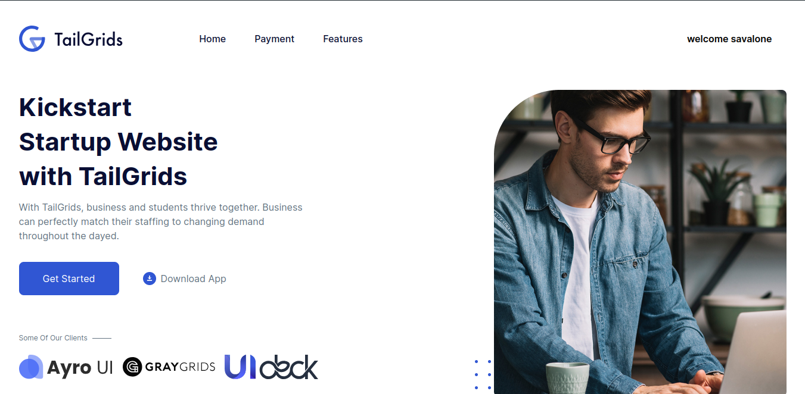

 

## Installation 

This preset is intended to be installed into a fresh Laravel application. Follow Laravel's installation instructions to ensure you have a working environment before continuing.

- composer require livewire/livewire laravel-frontend-presets/tall
- php artisan ui tall --auth
- npm install & npm run dev
- php artisan migrate

Laravel is accessible, powerful, and provides tools required for large, robust applications.

## Laravel TALL Preset

A front-end preset for Laravel to scaffold an application using the TALL stack, jumpstarting your application's development.

If you're not familiar with the name, it's an acronym that describes the main technologies involved in the stack:

- <a href="https://tailwindcss.com/">Tailwindcss</a>
- <a href="https://alpinejs.dev/">Alpinejs</a>
- <a href="https://laravel.com/">Laravel</a>
- <a href="https://livewire.laravel.com/">Livewire</a>
- <a href="https://tailgrids.com/templates">Tailgrids</a>

## Website

## Contributing

Thank you for considering contributing to the Laravel framework! The contribution guide can be found in the [Laravel documentation](https://laravel.com/docs/contributions).

## Code of Conduct

In order to ensure that the Laravel community is welcoming to all, please review and abide by the [Code of Conduct](https://laravel.com/docs/contributions#code-of-conduct).

## Security Vulnerabilities

If you discover a security vulnerability within Laravel, please send an e-mail to Taylor Otwell via [taylor@laravel.com](mailto:taylor@laravel.com). All security vulnerabilities will be promptly addressed.

## License

The Laravel framework is open-sourced software licensed under the [MIT license](https://opensource.org/licenses/MIT).
